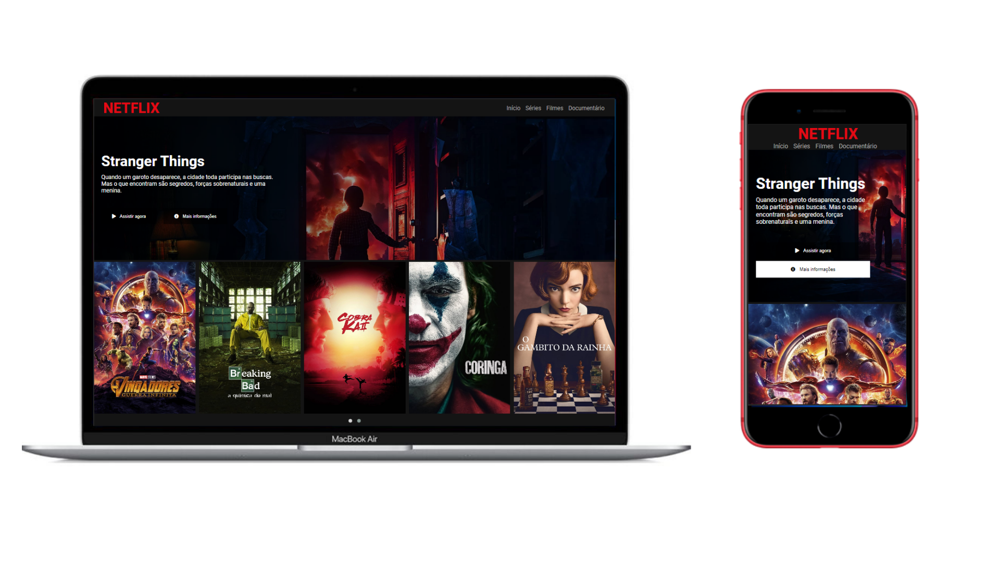

  
   
   <h1>HTML Web Developer</h1>

<h3 align="center">
  Clone da Netflix
</h3>

   

   
   
     

  

## :pushpin: Info

Este respositório é destina a criação de clone da interface da Netflix.
Foi ministrado pela [Digital Innovation One](https://web.digitalinnovation.one/home).

---
Made by Gabriel Sousa
